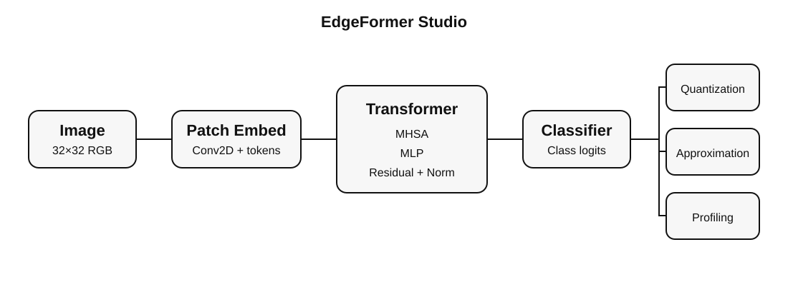

# EdgeFormer Studio

**Hardware-Aware Vision Transformers: Train → Quantize → Approximate → Profile → Visualize**

<p align="center">
  
</p>

<p align="center">
  <b>A research-oriented toolkit for hardware-aware Vision Transformer experimentation.</b>
</p>

<p align="center">
  <a href="https://github.com/matinfirooz/edgeformer-studio">
    
  </a>
  
  
  
  
  
  
</p>

---

## Overview

**EdgeFormer Studio** is a research-oriented PyTorch toolkit for exploring how Vision Transformers behave under hardware constraints.

It combines a compact Vision Transformer implementation with:

* Fake integer quantization
* Approximate-arithmetic sensitivity experiments
* Analytical MAC, memory, and energy proxies
* CPU/GPU latency benchmarking
* Attention visualization
* Hardware-aware design comparison
* Optional Gradio-based interactive inference

The central question behind EdgeFormer Studio is:

> **How much model quality can we preserve while reducing numerical precision, memory requirements, computational cost, and arithmetic fidelity?**

This makes the project useful for researchers and students working on:

* AI hardware accelerators
* Edge AI
* Efficient Transformers
* Vision Transformers
* Quantization
* Approximate computing
* Hardware/software co-design

> **Important:** The energy model included in EdgeFormer Studio is a configurable analytical proxy, not a silicon measurement. Replace its coefficients with values obtained from your FPGA, ASIC, synthesis, or physical-design flow before making hardware claims.

---

# Features

* Tiny Vision Transformer written from scratch in readable PyTorch
* CIFAR-10 and CIFAR-100 training pipeline
* FP32 baseline evaluation
* N-bit symmetric fake post-training quantization
* QAT-style `FakeQuantLinear` building block
* Statistical approximate-linear simulation
* Per-model MAC estimation
* Parameter-memory estimation at arbitrary bit widths
* Configurable compute-energy proxy
* CPU/GPU latency benchmarking
* Attention-map extraction and visualization
* FP32 vs INT8-simulated vs approximate design comparison
* Gradio inference demo
* PyTest unit tests
* YAML experiment configurations

---

# Repository Structure

```text
edgeformer-studio/
├── configs/
│   ├── cifar10.yaml
│   ├── cifar100.yaml
│   └── tiny_imagenet.yaml
│
├── edgeformer/
│   ├── models/
│   ├── quantization/
│   ├── approximate/
│   ├── profiling/
│   ├── visualization/
│   └── utils/
│
├── scripts/
│   ├── train.py
│   ├── evaluate.py
│   ├── quantize.py
│   ├── benchmark.py
│   └── compare_models.py
│
├── demo/
│   └── app.py
│
├── tests/
├── assets/
├── results/
│
├── requirements.txt
├── pyproject.toml
├── LICENSE
└── README.md
```

---

# Architecture

```text
Image
  │
  ▼
Patch Embedding
  │
  ├── Class Token
  │
  └── Positional Embedding
  │
  ▼
┌──────────────────────────────┐
│ Transformer Block × L        │
│                              │
│  LayerNorm                   │
│      │                       │
│      ▼                       │
│  Multi-Head Self-Attention   │◄── Attention Map Extraction
│      │                       │
│      ▼                       │
│  Residual Connection         │
│      │                       │
│      ▼                       │
│  LayerNorm                   │
│      │                       │
│      ▼                       │
│     MLP                      │
│      │                       │
│      ▼                       │
│  Residual Connection         │
└──────────────┬───────────────┘
               │
               ▼
      Classification Head
               │
       ┌───────┼────────┐
       │       │        │
       ▼       ▼        ▼
     FP32     INT8   Approximate
                      Arithmetic
                         │
                         ▼
                Hardware Profiler
                         │
          ┌──────────────┼──────────────┐
          ▼              ▼              ▼
       Latency          MACs        Memory/Energy
```

---

# Installation

Clone the repository:

```bash
git clone https://github.com/matinfirooz/edgeformer-studio.git
cd edgeformer-studio
```

Create a virtual environment:

```bash
python -m venv .venv
```

### Linux / macOS

```bash
source .venv/bin/activate
```

### Windows PowerShell

```powershell
.venv\Scripts\activate
```

Install the dependencies:

```bash
pip install -r requirements.txt
pip install -e .
```

---

# Quick Start

## Quick Smoke Test

You can benchmark an untrained model without downloading a dataset:

```bash
python scripts/benchmark.py --bits 32
```

Run the unit tests:

```bash
pytest -q
```

---

# Train on CIFAR-10

```bash
python scripts/train.py \
  --config configs/cifar10.yaml \
  --output checkpoints/vit_cifar10.pt
```

For a quick local test:

```bash
python scripts/train.py \
  --config configs/cifar10.yaml \
  --epochs 1
```

---

# Evaluate

Evaluate a trained checkpoint:

```bash
python scripts/evaluate.py \
  --checkpoint checkpoints/vit_cifar10.pt \
  --dataset cifar10
```

---

# Simulate INT8 Weights

Create a fake-quantized checkpoint:

```bash
python scripts/quantize.py \
  --checkpoint checkpoints/vit_cifar10.pt \
  --precision int8
```

Or directly evaluate a quantized copy:

```bash
python scripts/evaluate.py \
  --checkpoint checkpoints/vit_cifar10.pt \
  --dataset cifar10 \
  --bits 8
```

The current PTQ path simulates quantization by quantizing and dequantizing model parameters.

This is useful for numerical experiments and quantization-sensitivity studies, but it does **not** imply the use of integer-only kernels or provide a real INT8 hardware speedup.

---

# Approximate Arithmetic Experiments

Approximate arithmetic can be enabled during inference:

```bash
python scripts/evaluate.py \
  --checkpoint checkpoints/vit_cifar10.pt \
  --dataset cifar10 \
  --bits 8 \
  --approximate \
  --noise-scale 0.01
```

The `noise-scale` parameter controls the magnitude of output error injected into `Linear` layers during inference.

This provides a statistical approximation model that can be used to evaluate the sensitivity of Transformer layers to arithmetic errors.

```text
Approximate Arithmetic
          │
          ▼
   Numerical Error
          │
          ▼
Transformer Activations
          │
          ▼
 Attention Distribution
          │
          ▼
 Classification Output
```

This model is intentionally separated from any specific approximate-adder or approximate-multiplier circuit.

That makes it possible to later replace the synthetic error distribution with measured error characteristics from a real RTL arithmetic unit.

---

# Hardware-Aware Benchmarking

Run:

```bash
python scripts/benchmark.py \
  --checkpoint checkpoints/vit_cifar10.pt \
  --bits 8
```

Example output fields:

```text
==============================================
         EdgeFormer Hardware Report
==============================================

Device                       cuda
Parameters                   2.15 M
Estimated MACs               91.30 M

Attention MACs               35.10 M
MLP MACs                     55.00 M

Parameter Memory             2.05 MB @ 8-bit
Measured Latency             1.234 ms/batch
Energy Proxy                 0.02283 mJ

==============================================
```

Values vary depending on:

* Model configuration
* Numerical precision
* Dataset
* CPU/GPU
* Batch size
* Approximation parameters
* Energy-model coefficients

---

# Compare Design Points

EdgeFormer Studio can automatically compare multiple hardware-aware configurations.

Run:

```bash
python scripts/compare_models.py \
  --checkpoint checkpoints/vit_cifar10.pt
```

The script generates:

```text
results/design_comparison.csv
```

Example design space:

| Design      | Precision | Approximation | Description                        |
| ----------- | --------: | ------------: | ---------------------------------- |
| FP32        |    32-bit |            No | Accuracy baseline                  |
| INT8-Sim    |     8-bit |            No | Fake-quantized model               |
| INT8-Approx |     8-bit |           Yes | Quantized + approximate arithmetic |

Example comparison:

```text
Design              Accuracy    Latency    Memory    Energy Proxy
------------------------------------------------------------------
FP32                 92.10 %     5.70 ms    8.20 MB    0.091 mJ
INT8                 91.72 %     4.91 ms    2.05 MB    0.023 mJ
INT8 + Approx        91.19 %     4.76 ms    2.05 MB    0.021 mJ
```

These values are examples only.

---

# Attention Visualization

The Vision Transformer can directly return attention matrices:

```python
import torch
from edgeformer.models import TinyViT

model = TinyViT().eval()

x = torch.randn(1, 3, 32, 32)

logits, maps = model(
    x,
    return_attention=True
)

print(maps[-1].shape)
```

Example output:

```text
[batch, heads, tokens, tokens]
```

You can also generate and save a CLS-token attention visualization:

```python
import torch

from edgeformer.models import TinyViT
from edgeformer.visualization.attention_map import save_cls_attention

model = TinyViT().eval()

image = torch.randn(3, 32, 32)

save_cls_attention(
    model,
    image,
    "results/attention.png"
)
```

This makes it possible to compare:

```text
FP32 Attention
       │
       ├───────────────┐
       ▼               ▼
INT8 Attention    Approximate Attention
       │               │
       └───────┬───────┘
               ▼
      Attention Distortion
```

---

# Suggested Research Experiments

## 1. Precision Sweep

Compare:

```text
FP32
FP16
INT8
INT6
INT4
```

Measure:

* Top-1 accuracy
* Memory
* MAC cost
* Runtime
* Attention distortion

---

## 2. Layer Sensitivity Analysis

Approximate one Transformer block at a time.

For example:

```text
Layer                Accuracy Drop
----------------------------------
Attention Block 1       -0.08 %
Attention Block 2       -0.21 %
Attention Block 3       -1.34 %
Attention Block 4       -0.43 %

MLP Block 1             -0.11 %
MLP Block 2             -0.29 %
MLP Block 3             -0.87 %
MLP Block 4             -0.34 %
```

This can help answer:

> **Which Transformer layers can tolerate aggressive hardware approximation?**

---

## 3. Attention Distortion

Compare attention maps before and after quantization.

Possible metrics include:

* Mean Absolute Error
* Cosine similarity
* KL divergence
* Jensen-Shannon divergence
* Structural similarity

---

## 4. Pareto Search

Sweep:

```text
Embedding Dimension
        ×
Transformer Depth
        ×
Number of Heads
        ×
Bit Width
        ×
Approximation Strength
```

Then search for Pareto-optimal configurations across:

```text
Accuracy
   ↑
   │        ●
   │     ●
   │   ●
   │ ●
   │_____________________→ Efficiency
```

---

## 5. Circuit Mapping

Replace statistical error injection with error distributions measured from real approximate arithmetic circuits.

For example:

```text
Approximate RTL Adder
        │
        ▼
Exhaustive Error Characterization
        │
        ├── MAE
        ├── RMSE
        ├── WCE
        └── Error Probability
        │
        ▼
EdgeFormer Error Model
        │
        ▼
End-to-End ViT Accuracy
```

---

## 6. RTL Extension

Add synthesizable SystemVerilog components such as:

* INT8 MAC
* Approximate adder
* Approximate multiplier
* Systolic-array PE
* Systolic array
* Softmax accelerator
* Quantization unit

Then correlate:

```text
Model-Level Accuracy
        ↕
RTL Error Characteristics
        ↕
Area / Power / Delay
```

---

## 7. CUDA Extension

Implement optimized CUDA kernels for:

* QKV projection
* QKᵀ
* Softmax
* Attention × V
* Fused attention
* Quantized GEMM

Then compare custom kernels against PyTorch.

---

# Interactive Demo

After training a checkpoint:

```bash
python demo/app.py
```

The Gradio application allows a user to upload an image and obtain model predictions interactively.

Future versions can extend the interface to show:

* FP32 prediction
* INT8 prediction
* Approximate prediction
* Attention maps
* Confidence differences
* Latency
* Estimated memory
* Hardware-cost comparison

---

# Research Workflow

A typical EdgeFormer experiment follows:

```text
                 ┌─────────────┐
                 │   Dataset   │
                 └──────┬──────┘
                        │
                        ▼
                 ┌─────────────┐
                 │ Train ViT   │
                 └──────┬──────┘
                        │
        ┌───────────────┼────────────────┐
        │               │                │
        ▼               ▼                ▼
      FP32           Quantized       Approximate
        │               │                │
        └───────────────┼────────────────┘
                        │
                        ▼
              ┌──────────────────┐
              │ Accuracy Analysis │
              └────────┬─────────┘
                       │
                       ▼
              ┌──────────────────┐
              │ Hardware Profiler │
              └────────┬─────────┘
                       │
          ┌────────────┼─────────────┐
          ▼            ▼             ▼
       Latency        Memory         MACs
          │            │             │
          └────────────┼─────────────┘
                       ▼
                  Energy Proxy
                       │
                       ▼
                  Pareto Analysis
```

---

# Research Roadmap

* [x] Tiny ViT implementation
* [x] CIFAR training
* [x] Attention extraction
* [x] Fake post-training quantization
* [x] Approximate linear simulation
* [x] MAC/memory/energy proxy profiler
* [x] Runtime latency benchmark
* [x] Design comparison CSV
* [x] Unit tests
* [x] Gradio demo
* [ ] Automated per-layer sensitivity sweep
* [ ] Accuracy/latency Pareto plotting CLI
* [ ] Attention-distortion metrics
* [ ] Mixed-precision search
* [ ] Automated hardware-aware design-space exploration
* [ ] ONNX export
* [ ] CUDA attention kernel
* [ ] Quantized CUDA GEMM
* [ ] SystemVerilog MAC unit
* [ ] Approximate RTL arithmetic units
* [ ] Systolic-array RTL
* [ ] Verilator co-simulation
* [ ] FPGA synthesis example
* [ ] OpenROAD ASIC flow
* [ ] RTL-to-model error calibration
* [ ] PPA/accuracy Pareto exploration

---

# Design Philosophy

EdgeFormer Studio deliberately separates three types of experimental evidence.

### 1. Model Accuracy

Measured using real datasets and inference.

### 2. Runtime Latency

Measured directly on the CPU or GPU running the benchmark.

### 3. Hardware Estimates

Analytical proxies unless explicitly replaced by:

* RTL simulation
* FPGA synthesis
* ASIC synthesis
* Place and route
* Power analysis

Keeping these measurements separate prevents hardware claims from being overstated and makes the project easier to evolve into serious hardware/software co-design research.

---

# Long-Term Vision

The long-term goal is to transform EdgeFormer Studio from a model-analysis toolkit into an end-to-end **AI hardware/software co-design framework**.

```text
PyTorch Model
      │
      ▼
Quantization
      │
      ▼
Approximation Search
      │
      ▼
Hardware Mapping
      │
      ├──────────────┐
      ▼              ▼
    CUDA             RTL
      │              │
      ▼              ▼
GPU Benchmark    Synthesis / PPA
      │              │
      └───────┬──────┘
              ▼
       Accuracy + PPA
              │
              ▼
         Pareto Search
```

The ultimate objective is to connect **algorithm-level accuracy** with **hardware-level efficiency**.

---

# Contributing

Contributions are welcome.

Interesting contributions include:

* New quantization algorithms
* Mixed-precision inference
* Approximate arithmetic models
* Attention variants
* Hardware profiler backends
* CUDA kernels
* FPGA implementations
* ASIC implementations
* SystemVerilog modules
* Hardware synthesis scripts
* Additional datasets
* Additional Transformer architectures

Create a development branch:

```bash
git checkout -b feature/my-feature
```

Add your changes:

```bash
git add .
git commit -m "Add my feature"
```

Push:

```bash
git push origin feature/my-feature
```

Then open a pull request on:

```text
https://github.com/matinfirooz/edgeformer-studio
```

---

# Citation

If **EdgeFormer Studio** contributes to your academic work, please cite the repository:

```bibtex
@software{matinfirooz_edgeformer_2026,
  author       = {matinfirooz},
  title        = {EdgeFormer Studio: Hardware-Aware Vision Transformer Analysis},
  year         = {2026},
  publisher    = {GitHub},
  url          = {https://github.com/matinfirooz/edgeformer-studio}
}
```

---

# License

This project is released under the **MIT License**.

See [`LICENSE`](LICENSE) for details.

---

# Support

If you find **EdgeFormer Studio** useful, consider giving the repository a.

It helps others discover the project and supports continued development.

<p align="center">
  <b>Built for efficient AI and hardware/software co-design. </b>
</p>

<p align="center">
  <a href="https://github.com/matinfirooz/edgeformer-studio">
    github.com/matinfirooz/edgeformer-studio
  </a>
</p>
